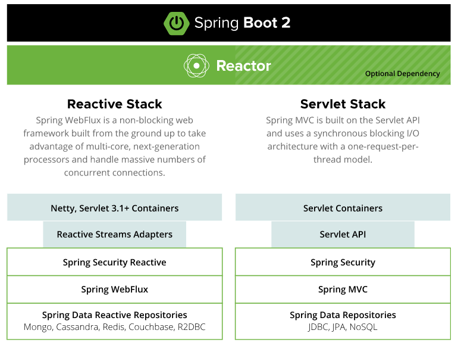

* webplux 왜 쓸까?

    1. 쓰레드풀의 딜레마
    - cpu/메모리가 충분하지만 쓰레드가 모자라서 처리율 처하... (리눅스 놀고있음)
    - 그래서 쓰레드를 과도하게 늘리면 이번에는 메모리, cpu 부하로 서능 저하
    - 컨텍스트 스위칭이라 하여 cpu간 전환 과정은 엄청난 부하가 필요
    - 즉, 쓰레드를 무조건 늘린다고 문제를 해결할 수 있는 것은 아님

    2. 적은수의 스레드로 동시성을 처리
    - 속도가 빠르다 보다는 적은 리소스로 많은 트랙픽을 감당한다

    3. non-blocking, functional programming
    - 함수가 반환값, 인자가 될수 있음 = 메소드 체이닝과 람다를 섞어 쓰는 것

    4. reactive programming
    - reactive stream
        Async, non-blocking으로 작동하는 stream
        publisher(웹클라이언트, db) 에서 변경이 생기면 subscriber에 변경된 데이터들을 stream으로 전달
        이 stream으로 프로그래밍하는 패러다임, 모든 것은 stream 이다..
    - backpressure
        subscriber 로 들어오는 Stream 양을 조정, 적은 컴퓨팅 자원으로 일을 처리하기 가능한 정도씩만 받기
    - Mono, Flux 는 단일/복수던 Stream 처럼 사용하되 reactive 하게 작동할 수 있다.

    5. netty
    - 처음부터 끝까지 reactive 해야 한다 (reactive stack / servlet stack 은 나눠져 있음)	

* 어디서 쓰는게 좋을까?

    1. 잘돌아가는 좋은 구조의 스프링 mvc 어플이면 변경 X 
        코드, 디버깅 등 익숙하고, 대부분 라이브러리가 블로킹 방식이라 선택지가 많다.

    2. 소규모나 복잡도가 적은 마이크로한 서비스에 선택해볼만 함..

    3. MSA 기반에서 스프링 mvc 와 webplux 혼합해서 사용해도 됨.. (구현 목적에 맞는 걸 그때 그때 사용하면 됨)

* 참고 
    1. 공식문서 : https://spring.io/reactive

